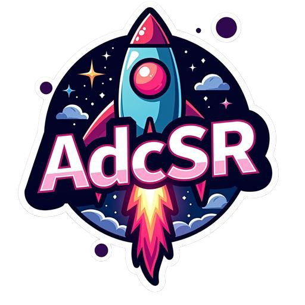
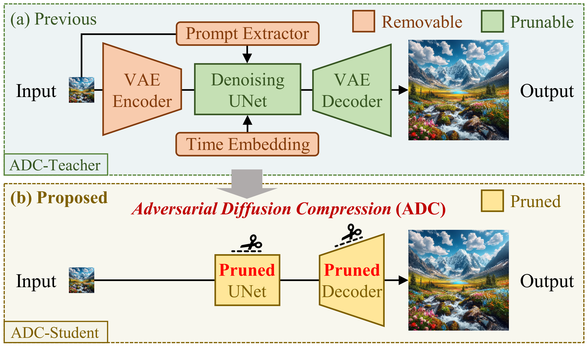
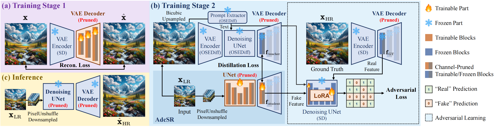
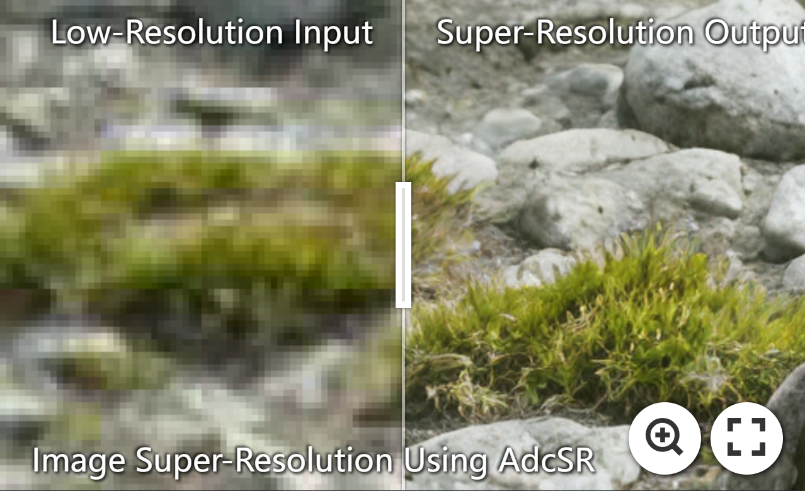
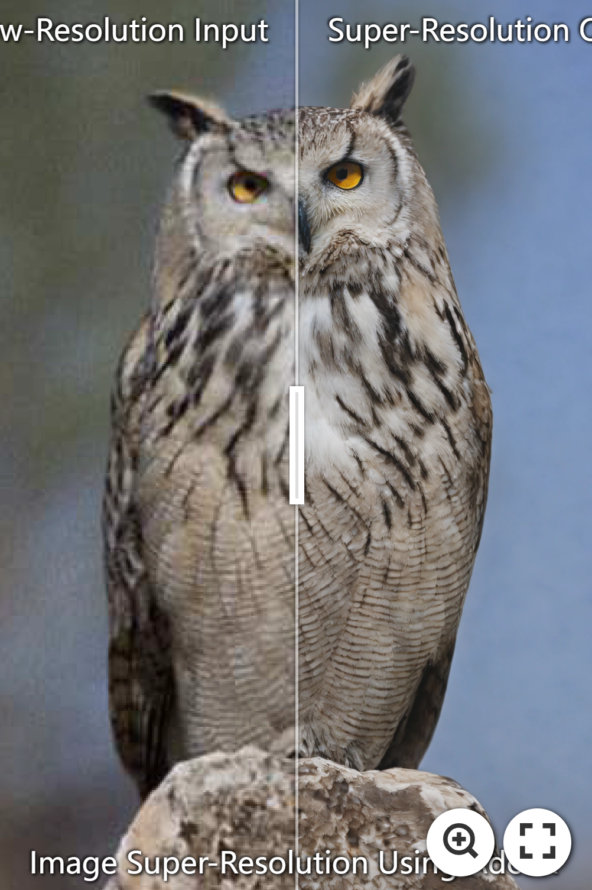

<p align="center">
   
</p>

# (CVPR 2025) Adversarial Diffusion Compression for Real-World Image Super-Resolution [PyTorch]

[](https://arxiv.org/abs/2411.13383) 

[Bin Chen](https://scholar.google.com/citations?user=aZDNm98AAAAJ)<sup>1,3,\*</sup>
| Gehui Li<sup>1,\*</sup>
| [Rongyuan Wu](https://scholar.google.com/citations?user=A-U8zE8AAAAJ)<sup>2,3,\*</sup>
| [Xindong Zhang](https://scholar.google.com/citations?user=q76RnqIAAAAJ)<sup>3</sup>
| [Jie Chen](https://aimia-pku.github.io/)<sup>1,†</sup>
| [Jian Zhang](https://jianzhang.tech/)<sup>1,†</sup>
| [Lei Zhang](https://www4.comp.polyu.edu.hk/~cslzhang/)<sup>2,3</sup>

<sup>1</sup> *Peking University*, <sup>2</sup> *The Hong Kong Polytechnic University*, <sup>3</sup> *OPPO Research Institute*

<sup>*</sup> Equal Contribution. <sup>†</sup> Corresponding Authors.

⭐ **If AdcSR is helpful to you, please star this repo. Thanks!** 🤗

## 🌟 Overview

### Highlights

- **Adversarial Diffusion Compression (ADC).** We remove and prune redundant modules from the one-step diffusion network [OSEDiff](https://github.com/cswry/OSEDiff) and apply adversarial distillation to retain generative capabilities despite reduced capacity.
- **Real-Time [Stable Diffusion](https://huggingface.co/stabilityai/stable-diffusion-2-1)-Based Image Super-Resolution.** AdcSR super-resolves a 128×128 image to 512×512 **in just 0.03s 🚀** on an A100 GPU.
- **Competitive Visual Quality.** Despite **74% fewer parameters 📉** than [OSEDiff](https://github.com/cswry/OSEDiff), AdcSR achieves **high-quality results** across multiple benchmarks.

### Framework

1. **Structural Compression**
   - **Removable modules** (VAE encoder, textual prompt extractor, cross-attention, time embeddings) are eliminated.
   - **Prunable modules** (UNet, VAE decoder) are **channel-pruned** to optimize efficiency while preserving performance.

<p align="center">
   
</p>

2. **Two-Stage Training**
   1. **Pretraining a Pruned VAE Decoder** to maintain its ability to decode latent representations.
   2. **Adversarial Distillation** to align compressed network features with the teacher model (e.g., [OSEDiff](https://github.com/cswry/OSEDiff)) and ground truth images.

<p align="center">
   
</p>

## 😍 Visual Results

[](https://imgsli.com/MzU2MjU1) [](https://imgsli.com/MzU2MjU2) [](https://imgsli.com/MzU2MjU3)


## ⚙ Installation

```shell
git clone https://github.com/Guaishou74851/AdcSR
cd AdcSR
conda create -n AdcSR python=3.10
conda activate AdcSR
pip install --upgrade pip
pip install -r requirements.txt
chmod +x train.sh train_debug.sh test_debug.sh evaluate_debug.sh
```

## ⚡ Test

1. **Download test datasets** (`DIV2K-Val.zip`, `DRealSR.zip`, `RealSR.zip`) from [Google Drive](https://drive.google.com/drive/folders/1JBOxTOOWi6ietCRTTbhjg8ojHrals4dh?usp=sharing) or [PKU Disk](https://disk.pku.edu.cn/link/AAD499197CBF054392BC4061F904CC4026).
2. **Unzip** them into `./testset/`, ensuring the structure:
   ```
   ./testset/DIV2K-Val/LR/xxx.png
   ./testset/DIV2K-Val/HR/xxx.png
   ./testset/DRealSR/LR/xxx.png
   ./testset/DRealSR/HR/xxx.png
   ./testset/RealSR/LR/xxx.png
   ./testset/RealSR/HR/xxx.png
   ```
3. **Download model weights** (`net_params_200.pkl`) from the same link and place it in `./weight/`.  
4. **Run the test script** (or modify and execute `./test_debug.sh` for convenience):  
   ```bash
   python test.py --epoch=200 --LR_dir=path_to_LR_images --SR_dir=path_to_SR_images
   ```
   The results will be saved in `path_to_SR_images`.
5. **Test Your Own Images**:
   - Place your **low-resolution (LR)** images into `./testset/xxx/`.
   - Run the command with `--LR_dir=./testset/xxx/`, and the model will perform **x4 super-resolution**.

## 🍭 Evaluation

Run the evaluation script (or modify and execute `./evaluate_debug.sh` for convenience):
```bash
python evaluate.py --HR_dir=path_to_HR_images --SR_dir=path_to_SR_images
```

## 🔥 Train

This repo provides code for **Stage 2** training (**adversarial distillation**). For **Stage 1** (pretraining the channel-pruned VAE decoder), refer to our paper and use the [Latent Diffusion Models](https://github.com/CompVis/latent-diffusion) repo.

1. **Download pretrained model weights** (`DAPE.pth`, `halfDecoder.ckpt`, `osediff.pkl`, `ram_swin_large_14m.pth`) from [Google Drive](https://drive.google.com/drive/folders/1JBOxTOOWi6ietCRTTbhjg8ojHrals4dh?usp=sharing) or [PKU Disk](https://disk.pku.edu.cn/link/AAD499197CBF054392BC4061F904CC4026), and place them in `./weight/pretrained/`.
2. **Download the [LSDIR](https://huggingface.co/ofsoundof/LSDIR) dataset** and store it in your preferred location.
3. **Modify the dataset path** in `config.yml`:
   ```yaml
   dataroot_gt: path_to_HR_images_of_LSDIR
   ```
4. **Run the training script** (or modify and execute `./train.sh` or `./train_debug.sh`):
   ```bash
   CUDA_VISIBLE_DEVICES=0,1,2,3,4,5,6,7 python -m torch.distributed.run --nproc_per_node=8 --master_port=23333 train.py
   ```
   The trained model will be saved in `./weight/`.
   
## 🥰 Acknowledgement

This project is built upon the codes of [Latent Diffusion Models](https://github.com/CompVis/latent-diffusion), [Diffusers](https://github.com/huggingface/diffusers), [BasicSR](https://github.com/XPixelGroup/BasicSR), and [OSEDiff](https://github.com/cswry/OSEDiff). We sincerely thank the authors of these repos for their significant contributions.

## 🎓 Citation

If you find our work helpful, please consider citing:

```latex
@inproceedings{chen2025adversarial,
  title={Adversarial Diffusion Compression for Real-World Image Super-Resolution},
  author={Chen, Bin and Li, Gehui and Wu, Rongyuan and Zhang, Xindong and Chen, Jie and Zhang, Jian and Zhang, Lei},
  booktitle={Proceedings of the IEEE/CVF Conference on Computer Vision and Pattern Recognition},
  year={2025}
}
```
